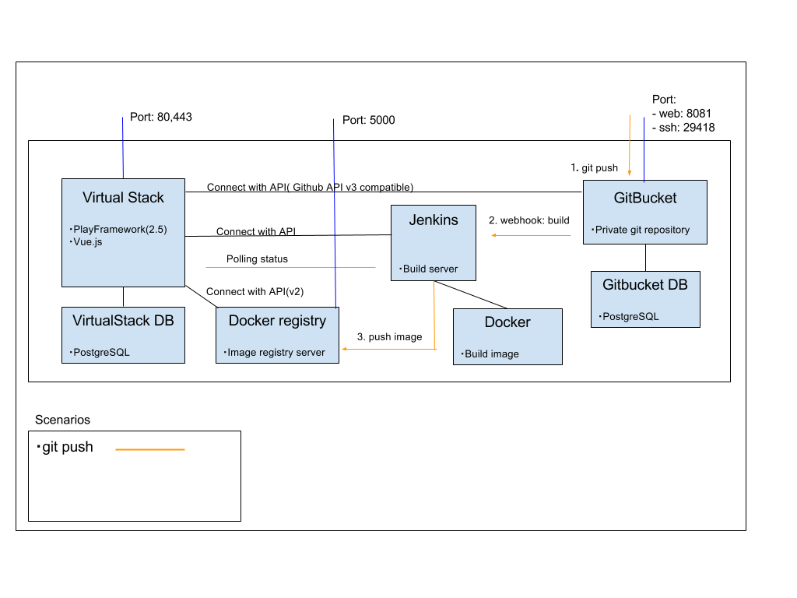
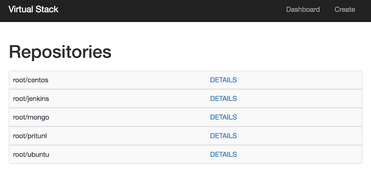
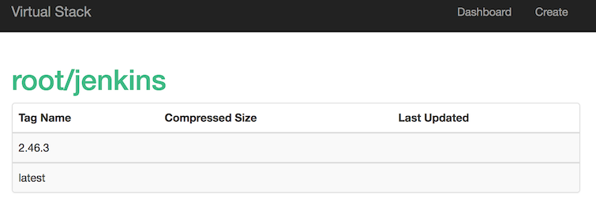
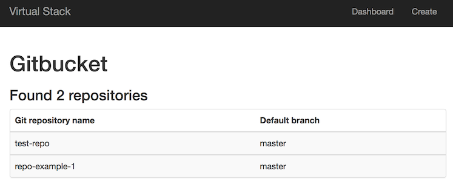

# VirtualStack

`VirtualStack` is a simple Docker registry (v2) that provides user authentication and enables automatic build.

This application is used to showcase the Playframework as well as Vue.js. This application makes use of the following:

- [Playframework 2.5](http://www.playframework.com)
  - [Javascript Routing](https://www.playframework.com/documentation/2.5.x/ScalaJavascriptRouting)
  - [JSON Automated Mapping](https://www.playframework.com/documentation/2.5.x/ScalaJsonAutomated)
  - [Scala Forms](https://www.playframework.com/documentation/2.5.x/ScalaForms)
- [Vue.js](https://vuejs.org/)
  - [Vue Router](http://router.vuejs.org/en/index.html)
  - [axios](https://github.com/mzabriskie/axios)
- [Node.js](https://nodejs.org/en)
- [Webpack](https://webpack.github.io)
- [Bootstrap](http://www.bootstrap.com) 
- [Slick](http://www.slick.typesafe.com)

`VirtualStack` enables automatic build using Jenkins and GitBucket.

This is a project under development. Please refer to [TODO.md](./TODO.md).
## Architecture

## ScreenShot

### Home

Retrieve and display the repository owned by the user from the Docker registry API.

### Repository details

Retrieve and display the specified repository details from the Docker registry API.

### Add repository

Get the repository on Gitbucket from the API and select the repository to be automatically built.

## Development

### Requirements

- sbt
- Node.js
- Docker

### Setup

#### Frontend

    npm install --global webpack
    npm install

#### Create docker containers

    docker-compose up -d

#### Run

    sbt "~run"
    webpack --watch

- Virtual Stack [http://localhost:9000]
- GitBucket [http://localhost:8081]
- Jenkins [http://localhost:8082]
- Docker registry [http://localhost:5000]

### Testing

    sbt test